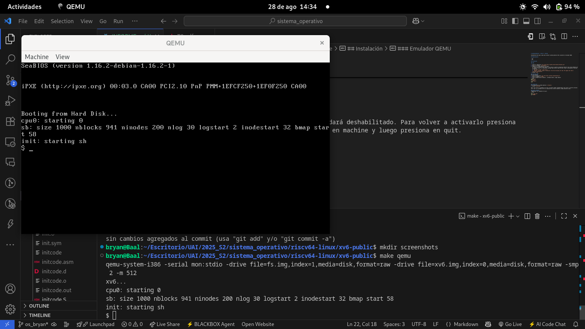
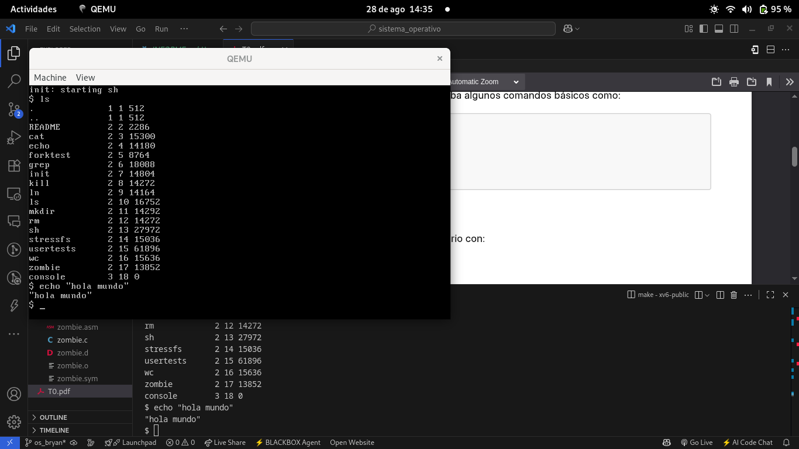
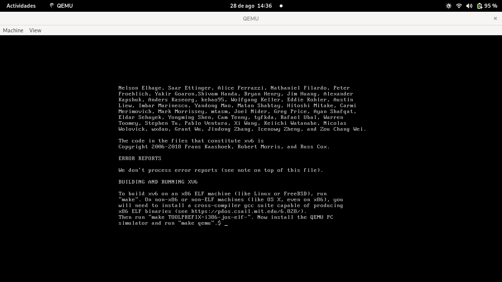

# Sistema Operativo - Tarea 0 - Informe

Documentación del paso a paso para instalar sistema operativo XV6 y ejecutarlo en emulador QEMU. 

## Requerimientos

- git
- gcc

## Instalación

### XV6

1. Clonar el repositorio `git clone https://github.com/mit-pdos/xv6-public.git`
2. Entrar al proyecto `cd xv6-public`
3. Compilar el sistema operativo con make.
   Si tienes una versión de gcc nueva (> 7.0) quita la opción de compilación *Werror* del archivo Makefile de lo contrario fallará al interpretar warnings como errores. Busca las dos líneas a continuación y borrales la bandera.
   1. `gcc -Werror -Wall -o mkfs mkfs.c`
   2. `CFLAGS = -fno-pic -static -fno-builtin -fno-strict-aliasing -O2 -Wall -MD -ggdb -m32 -Werror -fno-omit-frame-pointer`
4. Ejecuta `make`

### Emulador QEMU
En otra carpeta:
1. Clona el repositorio `git clone https://github.com/qemu/qemu.git`
2. Entra al proyecto `cd qemu`
3. Crea la carpeta build y ejecuta ../configure dentro, luego compila: 
```bash
mkdir build
cd build
../configure
make
```

## Levantar OS
En el proyecto del sistema operativo `xv6-public`
1. Ejecuta `make qemu`

Nota: esto inicia el simulador con el OS. El puntero quedará deshabilitado. Para volver a activarlo presiona ctrl + alt + g. Si deseas cerrar la simulación haz click en machine y luego presiona en quit. 

## Ingresa comandos 
Prueba ingrar los comandos de la guía
```bash
ls
echo "Hola xv6"
cat README
```

## Capturas de Pantalla

#### XV6 Corriendo en qemu

#### Comando ls y echo

#### Comando cat README
